# 尚硅谷_MyCat课程讲义

 讲师：尚硅谷 宋红康

官网：[http://www.atguigu.com](http://www.atguigu.com/)

***

## 1. Mycat概述

如今随着互联网的发展，数据的量级也是成指数的增长，从 GB 到 TB 到 PB。对数据的各种操作也是愈加的困难，传统的关系性数据库已经无法满足快速查询与插入数据的需求。这个时候 NoSQL 的出现暂时解决了这一危机。它通过降低数据的安全性，减少对事务的支持，减少对复杂查询的支持，来获取性能上的提升。

但是，在有些场合 NoSQL 一些折衷是无法满足使用场景的，就比如有些使用场景是绝对要有事务与安全指标的。这个时候 NoSQL 肯定是无法满足的，所以还是需要使用关系性数据库。如何使用关系型数据库解决海量存储的问题呢？此时就需要做数据库集群，为了提高查询性能将一个数据库的数据分散到不同的数据库中存储。

### 1.1 基本介绍

Mycat是`数据库分库分表`中间件。


**1、数据库中间件**

**中间件：是一类连接软件组件和应用的计算机软件，以便于软件各部件之间的沟通。**

例子：Tomcat，web中间件。

数据库中间件：连接java应用程序和数据库

**2、为什么要用Mycat？**

①  Java与数据库紧耦合。万一耦合的MySQL DBMS挂了怎么办？

②  高访问量、高并发对数据库的压力。

③  多个数据库读写请求数据不一致

**3、数据库中间件对比**

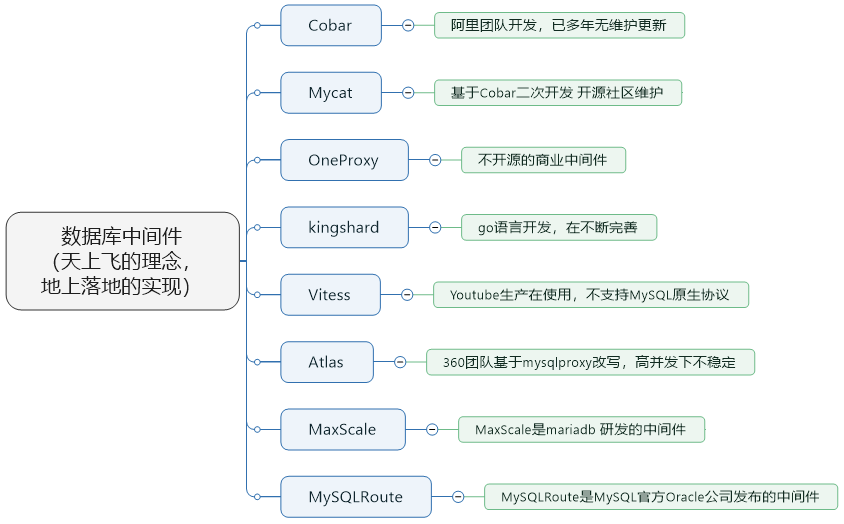

①  `Cobar`属于阿里B2B事业群，始于2008年，在阿里服役3年多，接管3000+个MySQL数据库的schema,集群日处理在线SQL请求50亿次以上。由于Cobar发起人的离职，Cobar停止维护。

②  `Mycat`是开源社区在阿里cobar基础上进行二次开发，解决了cobar存在的问题，并且加入了许多新的功能在其中。青出于蓝而胜于蓝。

③  `OneProxy`基于MySQL官方的proxy思想利用c语言进行开发的，OneProxy是一款商业`收费`的中间件。舍弃了一些功能，专注在`性能和稳定性上`。

④  `kingshard`由小团队用go语言开发，还需要发展，需要不断完善。

⑤  `Vitess`是Youtube生产在使用，架构很复杂。不支持MySQL原生协议，使用`需要大量改造成本`。

⑥  `Atlas`是360团队基于mysql proxy改写，功能还需完善，高并发下不稳定。

⑦  `MaxScale`是mariadb（MySQL原作者维护的一个版本） 研发的中间件

⑧  `MySQLRoute`是MySQL官方Oracle公司发布的中间件

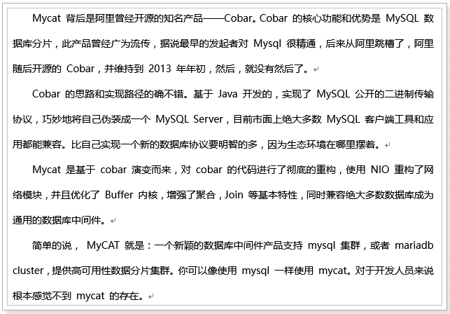

**3、Mycat的官网**

  http://www.mycat.io/

 

### 1.2 Mycat作用

**1、读写分离**

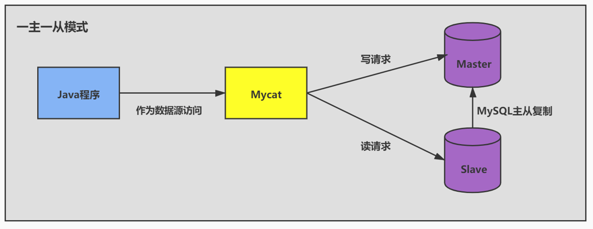


**2、数据分片**

垂直拆分（分库）、水平拆分（分表）、垂直+水平拆分（分库分表）

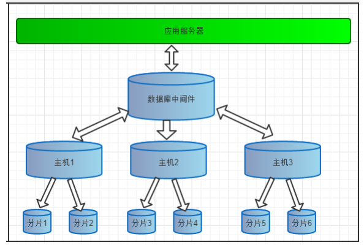

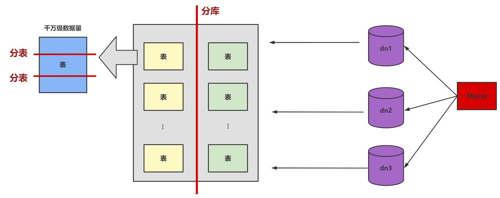

**3、多数据源整合**

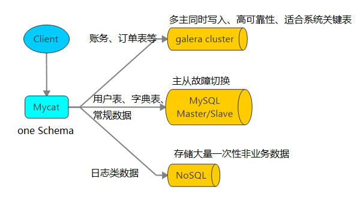

Mycat支持的数据库：


### 1.3 原理

Mycat 的原理中最重要的一个动词是“`拦截`”，它拦截了用户发送过来的 SQL 语句，首先对 SQL 语句做了一些特定的分析：如`分片分析、路由分析、读写分离分析、缓存分析`等，然后将此 SQL 发往后端的真实数据库，并将返回的结果做适当的处理，最终再返回给用户。

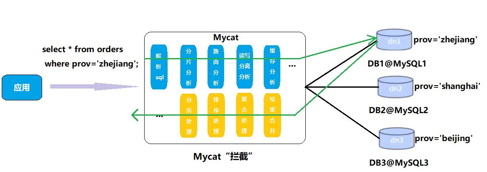

这种方式把数据库的分布式从代码中解耦出来，程序员察觉不出来后台使用`Mycat`还是`MySQL`。

整体过程可以概括为：`拦截` --  `分发` -- `响应`

## 2. 使用前准备工作

1、准备`4台`CentOS 虚拟机

2、每台虚拟机上需要安装好MySQL (可以是MySQL8.0 或者 MySQL5.7 皆可)

说明：前面我们讲过如何克隆一台CentOS。大家可以在一台CentOS上安装好MySQL，进而通过克隆的方式复制出3台包含MySQL的虚拟机。

注意：克隆的方式需要修改新克隆出来主机的：① `MAC地址` ② `hostname`  ③ `IP 地址`  ④ `UUID`。

此外，克隆的方式生成的虚拟机（包含MySQL Server），则克隆的虚拟机MySQL Server的UUID相同，必须修改，否则在有些场景会报错。比如：`show slave status\G`，报如下的错误：

```
Last_IO_Error: Fatal error: The slave I/O thread stops because master and slave have equal MySQL server UUIDs; these UUIDs must be different for replication to work.
```

修改MySQL Server 的UUID方式：

```
vim /var/lib/mysql/auto.cnf

systemctl restart mysqld
```


## 3. 安装启动

### 3.1 安装

**1、解压后即可使用**

 

解压缩文件拷贝到linux下 `/usr/local/`

```
[root@atguigu02 opt]# tar -zxvf Mycat-server-1.6.7.1-release-20190627191042-linux.tar.gz

[root@atguigu02 opt]# cp -r mycat/ /usr/local

[root@atguigu02 opt]# rm -rf mycat

```

 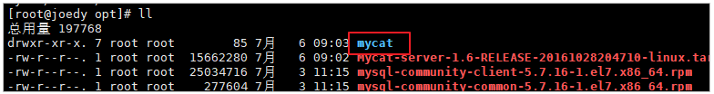

打开mycat目录结构如下：

```
bin：二进制执行文件
conf：配置文件目录
lib：依赖
logs：日志
```

**2、conf目录下三个配置文件**

 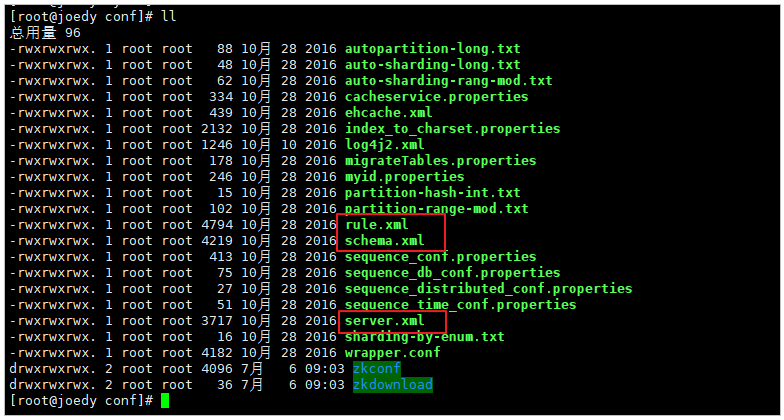

① `schema.xml`：定义逻辑库，表、分片节点等内容，实现读写分离

② `rule.xml`：定义分片规则，实现分库分表规则配置

③ `server.xml`：配置MyCat作为虚拟数据库的信息（地址、数据库名、用户名、密码等信息）

### 3.2 配置与启动

**1、修改配置文件 server.xml**

修改用户信息，与MySQL区分，如下：

```xml
…
<user name="mycat">
	<property name="password">123456</property>
	<property name="schemas">TESTDB</property>
</user>

<!-- 这里的TESTDB，理解为用户面向Mycat的统一的一个逻辑数据库。-->
```

 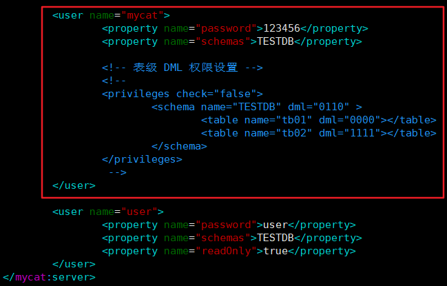

**2、修改配置文件 schema.xml**

- 删除`<schema>`标签间的表信息，增加dataNode属性 `dataNode="dn1"`

- `<dataNode>`标签只留一个，可修改属性值
- `<dataHost>`标签只留一个，修改属性值
  - 内部节点`<writeHost>` 和 `<readHost>`只留一对，修改属性值：url、user、password

```xml
<?xml version="1.0"?>
<!DOCTYPE mycat:schema SYSTEM "schema.dtd">
<mycat:schema xmlns:mycat="http://io.mycat/">
    <!-- 虚拟库与真实库的映射 
	name="TESTDB" 虚拟库的名字，对应刚刚在server.xml中设置的TESTDB
	sqlMaxLimit="100"，允许最大查询记录数
	checkSQLschema="false" 是否检查自动删除 “虚拟库名”
	dataNode="dn1" 虚拟库对应的真实database，值为dataNode标签的name
	-->
	<schema name="TESTDB" checkSQLschema="false" sqlMaxLimit="100" dataNode="dn1">
        <!-- 可以访问的表，只有设置在这里的表才会被MyCat管理访问 
		dataNode:虚拟库对应的真实database，对应<dataNode>标签。如果做分片，则配置多个，用逗号分隔；或者使用db$0-99，代表db0到db99的database
		rule：分片规则，如果没有则删除
		-->
		<!-- <table name="tb_item" dataNode="dn1"/> -->
	</schema>
	
	<!-- 真实的database信息，每一个dataNode就是一个数据库分片
		name：虚拟名称
		dataHost：真实库的主机信息，对应<dataHost>标签
		database：真实MySQL中真实的物理数据库名称
	-->
	<dataNode name="dn1" dataHost="host1" database="testdb" />
	
	<!-- 真实库的主机信息
		name：主机名,name属性值要与dataNode节点中的dataHost属性值对应
		maxCon：最大连接， minCon：最小连接
		balance：负载均衡方式：0~3四种选项。0，不开启读写分离。1~3都开启，区别是主是否参与读
		writeType：写负载均衡。永远设置0
		dbDriver：驱动类型，推荐native，可选jdbc
		switchType：主从的自动切换
	-->
	<dataHost name="host1" maxCon="1000" minCon="10" balance="0" writeType="0" dbType="mysql" dbDriver="native" switchType="1" slaveThreshold="100">

		<heartbeat>select user()</heartbeat>
		<!-- 这里设置写主机信息 -->
		<writeHost host="hostM1" url="192.168.140.128:3306" user="root" password="123123">

			<!-- 这里设置读主机信息 -->
			<readHost host="hostS1" url="192.168.140.127:3306" user="root" password="123123" />
		</writeHost>
	
	</dataHost>

</mycat:schema>

```

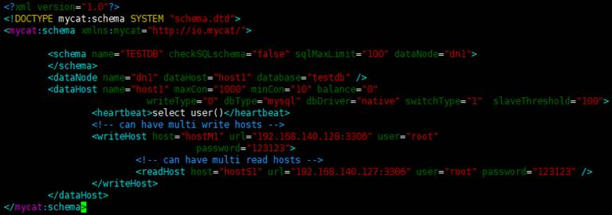

**3、验证数据库访问情况**

Mycat作为数据库中间件要和数据库部署在不同机器上，所以要验证远程访问情况。使用Mycat所在的主机访问Master和Slave端的MySQL Server。

注意：要关闭防火墙！

```mysql
#确认两台MySQL服务器可以通过远程进行访问
mysql -uroot -p123123 -h 192.168.140.128 -P 3306
mysql -uroot -p123123 -h 192.168.140.127 -P 3306

#如远程访问报错，请建对应用户
grant all privileges on *.* to root@'缺少的host'  identified by '123123';

```

**4、启动程序**

在 `mycat/bin` 目录下执行：

**方式1：控制台启动** ： `./mycat console`

**方式2：后台启动** ： `./mycat start`

为了能第一时间看到启动日志，方便定位问题，我们选择①控制台启动。

**其它操作：**

后台关闭：`./mycat stop`

后台重启：`./mycat restart`

状态： `./mycat status`

日志文件：`mycat/logs/wrapper.log`


**5、启动时可能出现报错**

如果操作系统是CentOS6.8，可能会出现域名解析失败错误，如下图：

 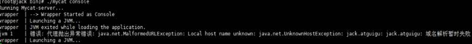

可以按照以下步骤解决

①  用 `vim` 修改 `/etc/hosts` 文件，在 127.0.0.1 后面增加你的机器名

 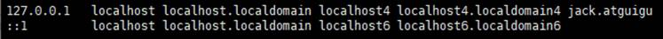

②  修改后重新启动网络服务

```
service network restart   #CentOS 6
```

 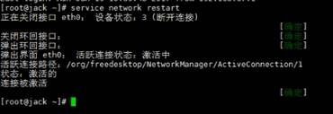

### 3.3 登录

#### 1. 登录后台管理窗口

`9066端口号对应后台管理窗口，用于运维人员管理维护Mycat使用`

```
mysql -umycat -p123456 -P 9066 -h 192.168.140.128
```

注意：这里我是在对应MySQL8.0中使用的Mycat，可能会报错：

 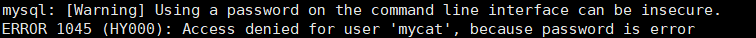

解决方式1：修改server.xml中的标签。

```xml
<property name="nonePasswordLogin">1</property> 
<!-- 0为需要密码登陆、1为不需要密码登陆 ,默认为0，设置为1则需要指定默认账户-->
```

重新启动mycat无密码登录，访问成功。 

解决方式2：更换MySQL的版本。


**常用命令如下：**

```
show database
```

 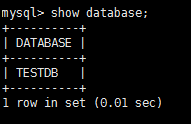

```
show @@help
```

 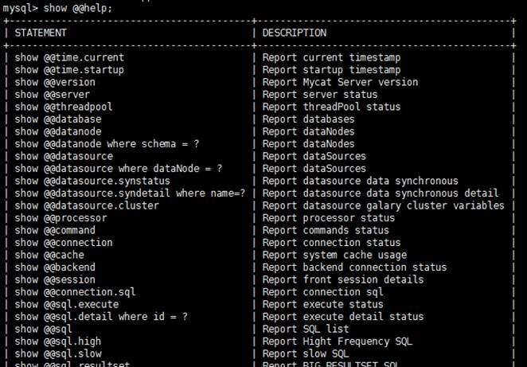

#### 2. 登录数据窗口

`8066端口号对应开发人员使用，用于通过Mycat查询数据`，我们选择这种方式访问Mycat

```
mysql -umycat -p123456 -P 8066 -h 192.168.140.128
```

```
show databases;

use TESTDB;

show tables;

```

#### 3. 项目中登录

其实项目中，只要改一个地方即可，就是jdbc的连接参数。

 


## 4. 主从复制原理

我们通过Mycat和MySQL的主从复制配合搭建数据库的读写分离，实现MySQL的高可用性。我们将搭建：`一主一从`、`双主双从`两种读写分离模式。

### 4.1 主从复制原理


提到主从同步的原理，我们就需要了解在数据库中的一个重要日志文件，那就是 Binlog 二 进制日志，它记录了对数据库进行更新的事件。实际上主从同步的原理就是基于 Binlog 进行数据同步的。在主从复制过程中，会基于 3 个线程来操作，一个`主库线程`，两个`从库线程`。 

二进制日志转储线程（Binlog dump thread）是一个主库线程。当从库线程连接的时候， 主库可以将二进制日志发送给从库，当主库读取事件的时候，会在 `Binlog 上加锁`，读取完成之后，再将锁释放掉。 

从库 I/O 线程会连接到主库，向主库发送请求更新 Binlog。这时从库的 I/O 线程就可以读取到主库的二进制日志转储线程发送的 `Binlog 更新部分`，并且拷贝到本地形成中继日志 （Relay log）。 

从库 SQL 线程会读取从库中的中继日志，并且`执行日志中的事件`，从而将从库中的数据与主库保持`同步`。

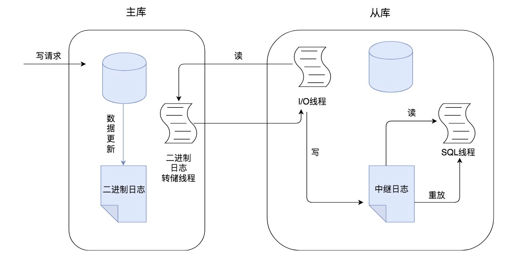

所以你能看到主从同步的内容就是二进制日志（Binlog），它虽然叫二进制日志，实际上存储的是一个又一个`事件（Event）`，这些事件分别对应着数据库的更新操作，比如 `INSERT`、`UPDATE`、`DELETE `等。另外我们还需要注意的是，不是所有版本的 MySQL 都默认开启服务器的二进制日志，在进行主从同步的时候，我们需要先检查服务器`是否已经开启了二进制日志`。

从服务器通过配置可以读取主服务器中二进制日志，并且执行日志中的事件。每个从服务器都能收到整个二进制日志的内容。从服务器需要识别日志中哪些语句应该被执行。除非特殊指定，`默认情况下主服务器中所有的事件都将被执行`。

### 4.2 MySQL复制三步骤：

1. `Master`将写操作记录到二进制日志（`binlog`）。这些记录过程叫做**二进制日志事件**(binary log events)；
2. `Slave`将`Master`的binary log  events拷贝到它的中继日志（`relay log`）；
3. `Slave`重做中继日志中的事件，将改变应用到自己的数据库中。 MySQL复制是异步的且串行化的，而且重启后从接入点开始复制。

### 4.3 复制的问题

复制的最大问题：**延时**  

### 4.4 复制的基本原则

- 每个`Slave`只有一个`Master`

- 每个`Slave`只能有一个唯一的服务器ID

- 每个`Master`可以有多个`Slave`

## 5. 主从复制与读写分离的实现

### 5.1 搭建主从复制：一主一从

一台`主机`用于处理所有`写请求`，一台`从机`负责所有`读请求`，架构图如下：


#### 1、搭建MySQL主从复制

**①  主机配置(host79)**

修改配置文件：`vim /etc/my.cnf`

```mysql
#主服务器唯一ID
server-id=1

#启用二进制日志
log-bin=mysql-bin

#设置不要复制的数据库(可设置多个)
binlog-ignore-db=mysql
binlog-ignore-db=information_schema

#设置需要复制的数据库。注意：MySQL是从接入点开始复制操作的
binlog-do-db=需要复制的主数据库名字

#设置logbin格式
binlog_format=STATEMENT
```

binlog日志三种格式：

- `STATEMENT模式`（基于SQL语句的复制(statement-based replication, SBR)）

  ```
  binlog_format=STATEMENT
  ```

  每一条会修改数据的sql语句会记录到binlog中。这是默认的binlog格式。

  优点：binlog文件较小，binlog可以用于实时的还原，而不仅仅用于复制。

  缺点：使用以下函数的语句也无法被复制：LOAD_FILE()、UUID()、USER()、FOUND_ROWS()、SYSDATE() (除非启动时启用了 --sysdate-is-now 选项)。数据表必须几乎和主服务器保持一致才行，否则可能会导致复制出错。

- `ROW模式`（基于行的复制(row-based replication, RBR)）

  ```
  binlog_format=ROW
  ```

  不记录每条sql语句的上下文信息，仅需记录哪条数据被修改了，修改成什么样了。

  优点：任何情况都可以被复制，这对复制来说是最安全可靠的。

  缺点：binlog 大了很多。无法从 binlog 中看到都复制了写什么语句。

- `MIXED模式`（混合模式复制(mixed-based replication, MBR)）

  ```
  binlog_format=MIXED
  ```

  以上两种模式的混合使用。

  

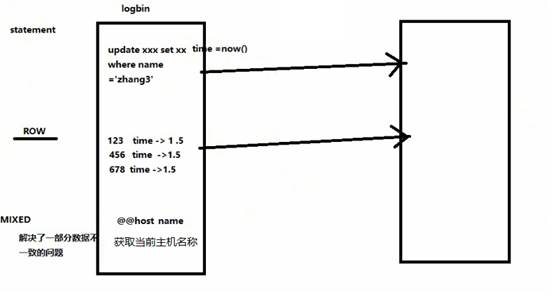

**② 从机配置(host80)**

修改配置文件：`vim /etc/my.cnf`

```mysql
#从服务器唯一ID
server-id=2

#启用中继日志
relay-log=mysql-relay
```

**③ 主机、从机重启MySQL服务**

```
systemctl restart mysqld

systemctl status mysqld
```

**④ 主机从机都关闭防火墙**

```
systemctl status firewalld
```

**⑤ 在Master主机上建立帐户并授权slave**

```
#在主机MySQL里执行授权主从复制的命令
GRANT REPLICATION SLAVE ON *.* TO 'slave'@'%' IDENTIFIED BY '123123';
```

**注意：如果使用的是MySQL8，需要如下的方式建立账户，并授权slave：**

```
create user 'slave'@'%' identified by 'HelloWorld_123';

GRANT REPLICATION SLAVE ON *.* TO slave@'%';

ALTER USER 'slave'@'%' IDENTIFIED WITH mysql_native_password BY 'HelloWorld_123';

flush privileges;

```

- **查询master的状态**

```mysql
show master status; #查看当前最新的一个binlog日志的编号名称，及最后一个事件结束的位置
```

 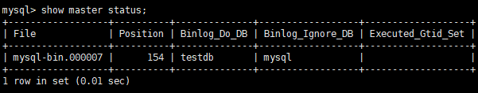

- 记录下File和Position的值


注意：执行完此步骤后不要再操作主服务器MySQL，防止主服务器状态值变化

**⑥ 在从机上配置需要复制的主机**

- 复制主机的命令

```
CHANGE MASTER TO MASTER_HOST='主机的IP地址',
MASTER_USER='slave',
MASTER_PASSWORD='123123',
MASTER_LOG_FILE='mysql-bin.具体数字',MASTER_LOG_POS=具体值;
```

```
举例：
CHANGE MASTER TO MASTER_HOST='192.168.1.110',
MASTER_USER='slave',
MASTER_PASSWORD='HelloWorld_123',
MASTER_LOG_FILE='mysql-bin.000002',MASTER_LOG_POS=1133;
```

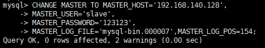

- **启动从服务器复制功能**

```
start slave;
```

如果报错：


可以执行如下操作，删除之前的relay_log信息。然后重新执行 change master to ...语句即可。

```
mysql> reset slave;
```

- 查看从服务器状态

```
show slave status\G;
```

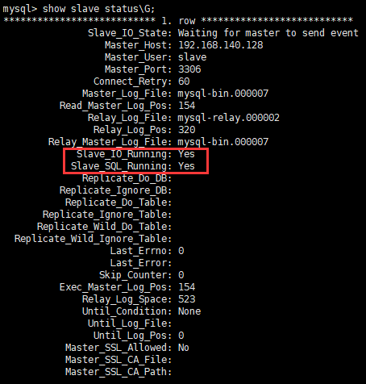

下面两个参数都是Yes，则说明主从配置成功！

```
Slave_IO_Running: Yes
Slave_SQL_Running: Yes
```

显式如下的情况，就是不正确的。可能错误的原因有：

```
1. 网络不通
2. 账户密码错误
3. 防火墙
4. mysql配置文件问题
5. 连接服务器时语法
6. 主服务器mysql权限
```


**⑦ 主机新建库、新建表、insert记录，从机复制**

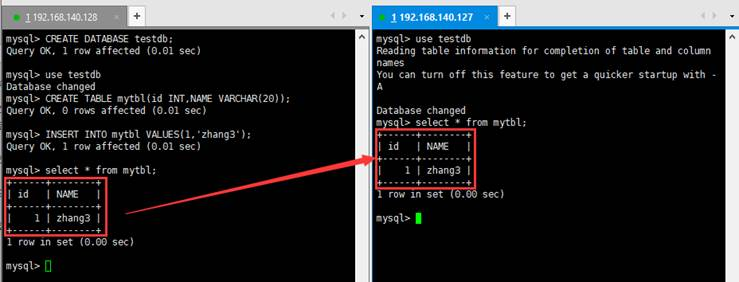

以上就搭建好了`主从复制`。


**补充说明1：如何停止从服务复制功能**

```
stop slave;
```

**补充说明2：如何重新配置主从**

对于从机来说，如果之前搭过主从。会报错如下：

 

如何重新配置主从？在从机上执行：

```
stop slave; 

reset master;
```

#### 2、Mycat登录访问

（方便起见，可以Xshell中启动三个窗口，针对Mycat所在的服务器进行连接，窗口分别命名为：mycat、bin、conf）

启动Mycat，在mycat/bin目录下执行如下命令，启动mycat

```
./mycat console
```

登录mycat账户，并访问数据库中的数据

```
mysql -umycat -p123456 -h192.168.140.128 -P8066
```

```
mysql> show database;
mysql> use TESTDB;
mysql> select * from mytbl;
```

### 5.2 实现一主一从的读写分离

之前的配置已分配了读写主机，实现了主从复制，是否已实现读写分离？

#### 1、验证读写分离

（1）在写主机插入如下数据，这样会出现主从主机数据不一致的情况。

```
insert into mytbl values (1,@@hostname);
```

（2）在Mycat里查询：

```
select * from mytbl; 
```

此时发现读取的数据`来自于写主机`。如果实现了读写分离，那此时应该读取的是从机的数据。说明此时没有实现读写分离。

#### 2、实现读写分离

修改Mycat的配置文件`schema.xml`的`<dataHost>`的balance属性，通过此属性配置读写分离的类型

```
负载均衡类型，目前的取值有4 种：
（1）balance="0", 不开启读写分离机制，所有读操作都发送到当前可用的 writeHost 上。

（2）balance="1"，全部的readHost 与 stand by writeHost 参与 select 语句的负载均衡，简单的说，当双主双从模式(M1->S1，M2->S2，并且 2M1 与 M2 互为主备)，正常情况下，M2,S1,S2 都参与 select 语句的负载均衡。

（3）balance="2"，所有读操作都随机的在 writeHost、readhost 上分发。

（4）balance="3"，所有读请求随机的分发到 readhost 执行，writerHost 不负担读压力。对应单主单从。

```

读写分离情况下，`将balance设置成3是对的`。这里为了演示动态效果，把balance设置成2，这样会在两个机器间切换查询。

停止mycat服务，修改balance：

```
…
<dataHost name="host1" maxCon="1000" minCon="10" balance="2" writeType="0" dbType="mysql" dbDriver="native" switchType="1" slaveThreshold="100">
…

```

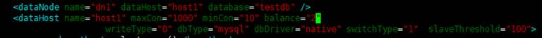

#### 3、启动Mycat

#### 4、验证读写分离

（1）在写主机数据库表mytbl中插入带系统变量数据，造成主从数据不一致

```
INSERT INTO mytbl VALUES(2,@@hostname);
```


 （2）在Mycat里查询mytbl表,可以看到查询语句在主从两个主机间切换

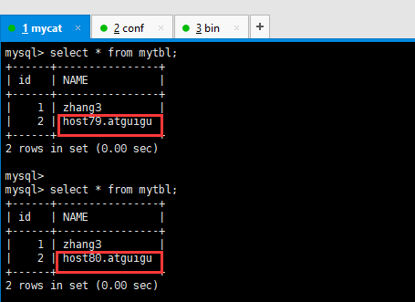

### 5.3 搭建主从复制：双主双从

一个主机m1用于处理所有写请求，它的从机s1和另一台主机m2还有它的从机s2负责所有读请求。当m1主机宕机后，m2主机负责写请求，m1、m2互为备机。架构图如下：


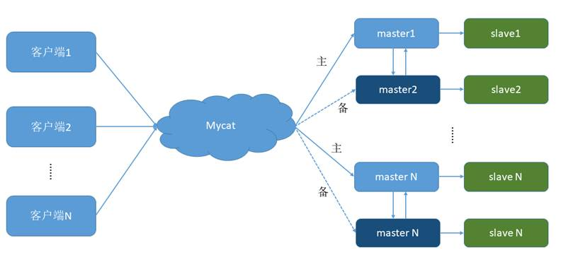

| 编号 | 角色    | IP地址          | 机器名         |
| ---- | ------- | --------------- | -------------- |
| 1    | Master1 | 192.168.140.128 | host79.atguigu |
| 2    | Slave1  | 192.168.140.127 | host80.atguigu |
| 3    | Master2 | 192.168.140.126 | host81.atguigu |
| 4    | Slave2  | 192.168.140.125 | host82.atguigu |

#### 0、储备

- 记得删除演示一主一从模式时创建的数据库`testdb`。

- 记得在之前的从机上执行：`stop slave` 和 `reset master `。

#### 1、 搭建MySQL主从复制（双主双从）

**①  双主机配置**

**Master1配置：**

修改配置文件：`vim /etc/my.cnf`

```
#【必须】主服务器唯一ID
server-id=1

#【必须】启用二进制日志
log-bin=mysql-bin

#设置不要复制的数据库(可设置多个)
binlog-ignore-db=mysql
binlog-ignore-db=information_schema

#【必须】设置需要复制的数据库
binlog-do-db=需要复制的主数据库名字

#设置logbin格式
binlog_format=STATEMENT

#【必须】在作为从数据库的时候，有写入操作也要更新二进制日志文件
log-slave-updates 

#【必须】表示自增长字段每次递增的量，指自增字段的起始值，其默认值是1，取值范围是1 .. 65535
auto-increment-increment=2 

#【必须】表示自增长字段从哪个数开始，指字段一次递增多少，他的取值范围是1 .. 65535
auto-increment-offset=1 

```

**Master2配置：**

修改配置文件：`vim /etc/my.cnf`

```
#【必须】主服务器唯一ID
server-id=3

#【必须】启用二进制日志
log-bin=mysql-bin

#设置不要复制的数据库(可设置多个)
binlog-ignore-db=mysql
binlog-ignore-db=information_schema

#【必须】设置需要复制的数据库
binlog-do-db=需要复制的主数据库名字

#设置logbin格式
binlog_format=STATEMENT

#【必须】在作为从数据库的时候，有写入操作也要更新二进制日志文件
log-slave-updates 

#【必须】表示自增长字段每次递增的量，指自增字段的起始值，其默认值是1，取值范围是1 .. 65535
auto-increment-increment=2 

#【必须】表示自增长字段从哪个数开始，指字段一次递增多少，他的取值范围是1 .. 65535
auto-increment-offset=2

```

**② 双从机配置**

**Slave1配置：**

修改配置文件：`vim /etc/my.cnf`

```
#【必须】从服务器唯一ID
server-id=2

#【必须】启用中继日志
relay-log=mysql-relay

```

**Slave2配置：**

修改配置文件：`vim /etc/my.cnf`

```
#【必须】从服务器唯一ID
server-id=4

#【必须】启用中继日志
relay-log=mysql-relay

```

**③ 双主机、双从机重启mysql服务**

**④ 主机从机都关闭防火墙**

**⑤ 在两台主机上分别建立帐户并授权slave**

```
#在主机MySQL里执行授权命令
GRANT REPLICATION SLAVE ON *.* TO 'slave'@'%' IDENTIFIED BY '123123';
```

**注意：如果使用的是MySQL8，需要如下的方式建立账户，并授权slave：**

```
create user 'slave'@'%' identified by 'HelloWorld_123';

GRANT REPLICATION SLAVE ON *.* TO slave@'%';

ALTER USER 'slave'@'%' IDENTIFIED WITH mysql_native_password BY 'HelloWorld_123';

flush privileges;
```


- 查询Master1的状态：

```
show master status;
```

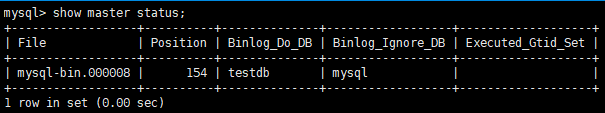

- 查询Master2的状态：

```
show master status;
```

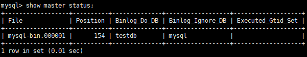

注意：

分别记录下File和Position的值。

执行完此步骤后不要再操作主服务器MySQL，防止主服务器状态值变化。

**⑥ 在从机上配置需要复制的主机**

Slave1复制Master1，Slave2复制Master2。

\#复制主机的命令

```
CHANGE MASTER TO MASTER_HOST='主机的IP地址',
MASTER_USER='slave',
MASTER_PASSWORD='123123',
MASTER_LOG_FILE='mysql-bin.具体数字',MASTER_LOG_POS=具体值;
```

 所以，

Slave1的复制命令：

 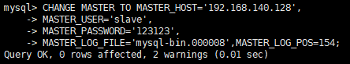

Slave2的复制命令：

 

 

- 启动两台从服务器复制功能

```
start slave;
```

-  查看从服务器状态

```
show slave status\G;
```

Slave1的复制Master1

 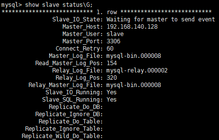

Slave2的复制Master2

 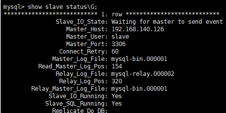

下面两个参数都是Yes，则说明主从配置成功！

```
Slave_IO_Running: Yes
Slave_SQL_Running: Yes
```

- 如果当初使用克隆的方式生成的虚拟机（包含MySQL Server），则克隆的虚拟机MySQL Server的UUID相同，必须修改，否则`show slave status\G`会报错。具体修改方式在《2.使用前准备工作》


**⑦ 两个主服务器互相复制**

Master2复制Master1，Master1复制Master2

Master2的复制命令：

 

Master1的复制命令：

 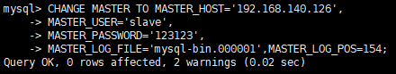

-  启动两台主服务器复制功能

```
start slave;
```

-  查看从服务器状态

```
show slave status\G;
```

 Master2的复制Master1：

 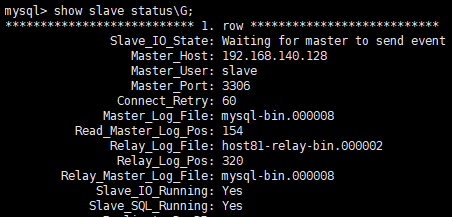

 Master1的复制Master2：

 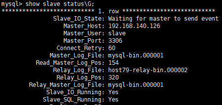

下面两个参数都是Yes，则说明主从配置成功！

```
Slave_IO_Running: Yes
Slave_SQL_Running: Yes
```

⑧ Master1主机新建库、新建表、insert记录，Master2和从机复制

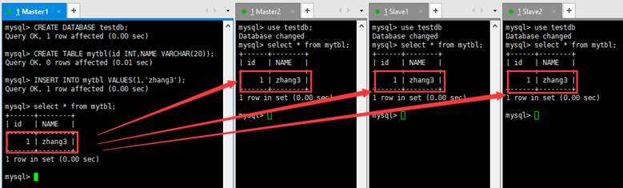

⑨ 如何停止从服务复制功能

```
stop slave;
```

⑩ 如何重新配置主从

```
stop slave; 
reset master;
```

### 5.4 实现双主双从机的读写分离

上述操作实现了双主双从的复制，下面实现读写分离操作。

#### 1、修改配置文件

修改Mycat的配置文件`schema.xml`的`<dataHost>`的`balance`属性，通过此属性配置读写分离的类型

```
负载均衡类型，目前的取值有4 种：
（1）balance="0", 不开启读写分离机制，所有读操作都发送到当前可用的 writeHost 上。

（2）balance="1"，全部的 readHost 与 stand by writeHost 参与 select 语句的负载均衡，简单的说，当双主双从模式(M1->S1，M2->S2，并且 M1 与 M2 互为主备)，正常情况下，M2,S1,S2 都参与 select 语句的负载均衡。

（3）balance="2"，所有读操作都随机的在 writeHost、readhost 上分发。

（4）balance="3"，所有读请求随机的分发到 readhost 执行，writerHost 不负担读压力

```

为了双主双从读写分离balance设置为1：

```xml
…
<dataNode name="dn1" dataHost="host1" database="testdb" />

<dataHost name="host1" maxCon="1000" minCon="10" balance="1" writeType="0" dbType="mysql" dbDriver="native" switchType="1"  slaveThreshold="100" >

		<heartbeat>select user()</heartbeat>

		<!-- can have multi write hosts -->
		<writeHost host="hostM1" url="192.168.140.128:3306" user="root" password="123123">
			<!-- can have multi read hosts -->
			<readHost host="hostS1" url="192.168.140.127:3306" user="root" password="123123" />
		</writeHost>
		<!--  复制一份 -->
		<writeHost host="hostM2" url="192.168.140.126:3306" user="root" password="123123">
			<!-- can have multi read hosts -->
			<readHost host="hostS2" url="192.168.140.125:3306" user="root" password="123123" />
		</writeHost>

</dataHost>
…

#balance="1": 全部的readHost与stand by writeHost参与select语句的负载均衡。

#writeType="0": 所有写操作发送到配置的第一个writeHost，第一个挂了切到还生存的第二个
#writeType="1"，所有写操作都随机的发送到配置的 writeHost，1.5 以后废弃不推荐
#writeHost，重新启动后以切换后的为准，切换记录在配置文件中:dnindex.properties 。
#switchType="1": 1 默认值，自动切换。
#               -1 表示不自动切换
#                2 基于 MySQL 主从同步的状态决定是否切换。

```

主要修改内容见下图红框：

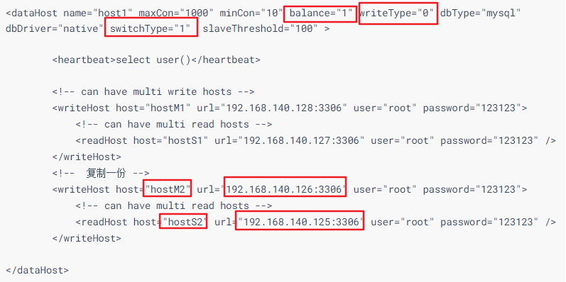  

#### 2、启动Mycat

#### 3、验证读写分离

在写主机Master1数据库表mytbl中插入带系统变量数据，造成主从数据不一致  

```
INSERT INTO mytbl VALUES(3,@@hostname);  
```

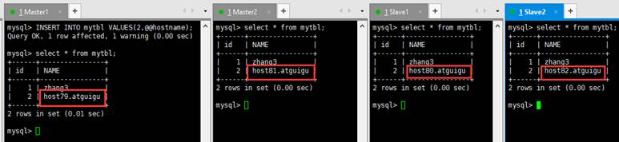  #

在Mycat里查询mytbl表,可以看到查询语句在Master2（host81）、Slave1（host80）、Slave2（host82）主从三个主机间切换。

  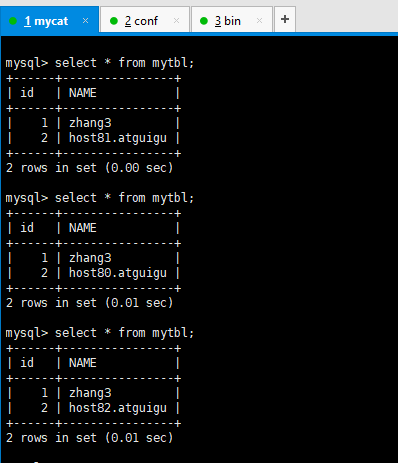     

#### 4、抗风险能力测试

停止数据库Master1

```
systemctl stop mysqld

systemctl status mysqld
```

  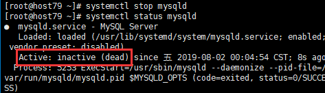

在Mycat里插入数据依然成功，Master2自动切换为写主机

```
INSERT INTO  mytbl VALUES(3,@@hostname);
```

 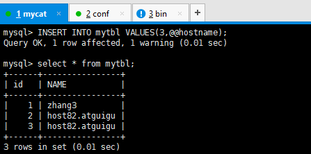

启动数据库Master1：

 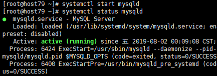

在Mycat里查询mytbl表,可以看到查询语句在Master1（host79）、Slave1（host80）、Slave2（host82）主从三个主机间切换：

 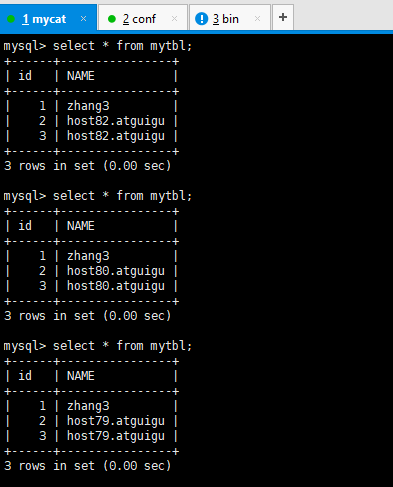        

Master1、Master2互做备机，负责写的主机宕机，备机切换负责写操作，保证数据库读写分离高可用性。

## 6. Mycat数据分片

### 6.1 什么是数据分片？

简单来说，就是指通过某种特定的条件，将我们存放在同一个数据库中的数据分散存放到多个数据库（主机）上面，以达到分散单台设备负载的效果。

### 6.2 切分模式

数据的切分（Sharding）根据其切分规则的类型，可以分为两种切分模式：

**1. 垂直（纵向）切分**：是按照不同的表（或者 Schema）来切分到不同的数据库（主机）之上

**2. 水平（横向）切分**：是根据表中的数据的逻辑关系，将同一个表中的数据按照某种条件拆分到多台数据库（主机）上面。

### 6.3 Mycat分片原理

MyCat的分片实现：

 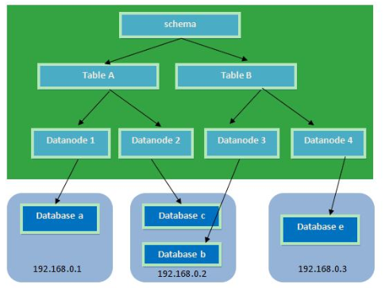

**逻辑库(schema) ：**MyCat作为一个数据库中间件，起到一个程序与数据库的桥梁作用。开发人员无需知道MyCat的存在，只需要知道数据库的概念即可。为了让MyCat更透明，它会把自己“伪装”成一个MySQL数据库，因此需要有一个虚拟的 database，在MyCat中也叫逻辑库，英文就是schema。

**逻辑表（table）：**既然有逻辑库，那么就会有逻辑表，分布式数据库中，对应用来说，读写数据的表就是逻辑表。逻辑表，可以是数据切分后，分布在一个或多个分片库中，也可以不做数据切分，不分片，只有一个表构成。

**分片节点(dataNode)：**数据切分后，一个大表被分到不同的分片数据库上面，每个表分片所在的数据库就是分片节点（dataNode）。

**节点主机(dataHost)：**数据切分后，每个分片节点（dataNode）不一定都会独占一台机器，同一机器上面可以有多个分片数据库，这样一个或多个分片节点（dataNode）所在的机器就是节点主机（dataHost）,为了规避单节点主机并发数限制，尽量将读写压力高的分片节点（dataNode）均衡的放在不同的节点主机（dataHost）。

**分片规则(rule)：**前面讲了数据切分，一个大表被分成若干个分片表，就需要一定的规则，这样按照某种业务规则把数据分到某个分片的规则就是分片规则，数据切分选择合适的分片规则非常重要，将极大的避免后续数据处理的难度。

## 6. 垂直拆分——分库

一个数据库由很多表构成，每个表对应着不同的业务，垂直拆分是指按照业务将表进行分类，分布到不同的数据库上面，这样也就将数据或者说压力分担到不同的库上面，如下图：

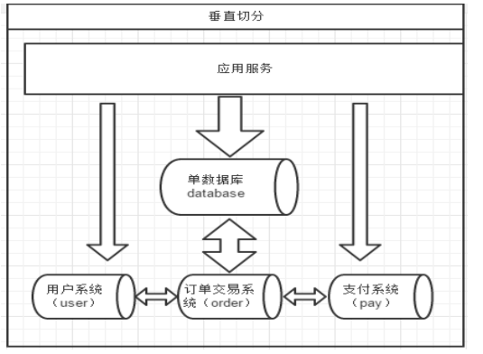

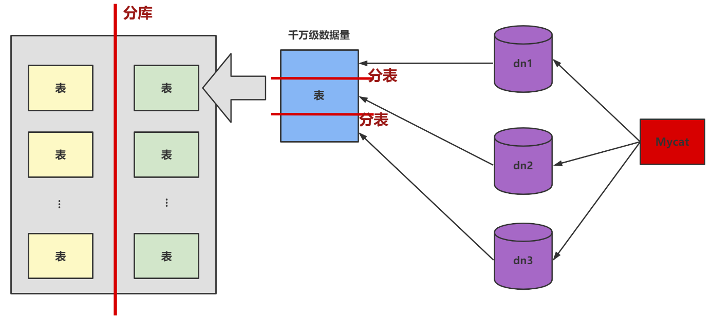

系统被拆分成了：用户、订单交易、支付几个模块。

> 【推荐】单表行数超过 500 万行或者单表容量超过 2GB，才推荐进行分库分表。 
>
> 说明：如果预计三年后的数据量根本达不到这个级别，请不要在创建表时就分库分表。
>
> 来源：阿里巴巴《Java开发手册》

### 6.1 如何划分表

一个问题：在两台主机上的两个数据库中的表，能否JOIN关联查询？

答案：不可以关联查询。

**分库的原则：**

1. **能不切分尽量不要切分**。数据量不是很大的库或者表，尽量不要分片。
2. **尽量按照功能模块分库，避免跨库join。**

```
#客户表  rows:20万 
CREATE TABLE customer(
    id INT AUTO_INCREMENT,
    NAME VARCHAR(200),
    PRIMARY KEY(id)
);

#订单表   rows:600万
CREATE TABLE orders(
    id INT AUTO_INCREMENT,
    order_type INT,
    customer_id INT,
    amount DECIMAL(10,2),
    PRIMARY KEY(id)  
); 

#订单详细表  rows:600万
CREATE TABLE orders_detail(
    id INT AUTO_INCREMENT,
    detail VARCHAR(2000),
    order_id INT,
    PRIMARY KEY(id)
);

#订单状态字典表   rows:20
CREATE TABLE dict_order_type(
    id INT AUTO_INCREMENT,
    order_type VARCHAR(200),
    PRIMARY KEY(id)
);

```

以上四个表如何分库？客户表分在一个数据库，另外三张都需要关联查询，分在另外一个数据库。

> 分布在同一台主机上不同数据库的表，可以进行JOIN查询操作。
>
> 分布在不同主机上的数据库中的表，不可以进行JOIN查询操作。

### 6.2 实现分库

#### 1、修改schema配置文件

```xml
…
<schema name="TESTDB" checkSQLschema="false" sqlMaxLimit="100" dataNode="dn1">
	<table name="customer" dataNode="dn2" ></table>
</schema>

<dataNode name="dn1" dataHost="host1" database="orders" />
<dataNode name="dn2" dataHost="host2" database="orders" />

<dataHost name="host1" maxCon="1000" minCon="10" balance="0" writeType="0" dbType="mysql" dbDriver="native" switchType="1"  slaveThreshold="100">

	<heartbeat>select user()</heartbeat>
    
    <!-- can have multi write hosts -->
    <writeHost host="hostM1" url="192.168.140.128:3306" user="root" password="123123">
    </writeHost>
</dataHost>

<dataHost name="hostM2" maxCon="1000" minCon="10" balance="0" writeType="0" dbType="mysql" dbDriver="native" switchType="1"  slaveThreshold="100">

	<heartbeat>select user()</heartbeat>

	<!-- can have multi write hosts -->
	<writeHost host="hostM2" url="192.168.140.127:3306" user="root" password="123123">
    </writeHost>
</dataHost>
…
```

主要修改的内容如下图的红框：

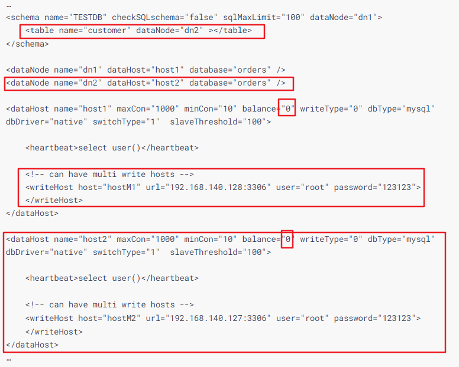

#### 2、新增两个空白库

分库操作不是在原来的老数据库上进行操作，需要准备两台机器分别安装新的数据库。

```
#在数据节点dn1、dn2上分别创建数据库orders
CREATE DATABASE orders;
```

#### 3、启动Mycat

```
./mycat console
```

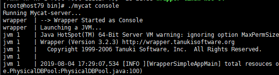

#### 4、访问Mycat进行分库

访问Mycat

```
mysql -umycat -p123456 -h 192.168.140.128 -P 8066
```

切换到TESTDB，创建4张表，查看表信息，可以看到成功分库：

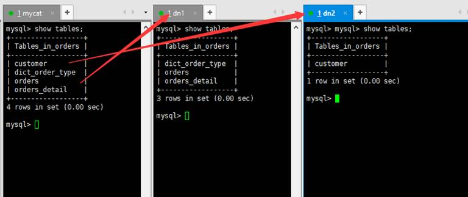

## 7. 水平拆分——分表

相对于垂直拆分，水平拆分不是将表做分类，而是按照某个字段的某种规则来分散到多个库之中，每个表中包含一部分数据。简单来说，我们可以将数据的水平切分`理解为是按照数据行的切分`，就是将表中的某些行切分到一个数据库，而另外的某些行又切分到其他的数据库中，如图： 

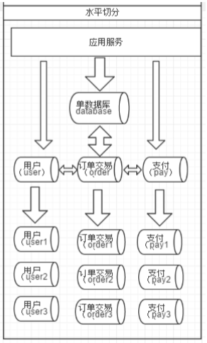 

### 7.1 实现分表

#### 1、选择要拆分的表

MySQL单表存储数据条数是有瓶颈的，单表达到`1000万条`数据就达到了瓶颈，会影响查询效率，需要进行水平拆分（分表）进行优化。

例如：例子中的`orders`、`orders_detail`都已经达到600万行数据，需要进行分表优化。

#### 2、分表字段的考量

以`orders`表为例，可以根据不同字段进行分表。即相同字段值的数据放到同一台主机的表中。

| 编号 | 分表字段              | 效果                                                         |
| ---- | --------------------- | ------------------------------------------------------------ |
| 1    | id（主键）、创建时间  | 查询订单注重时效，历史订单被查询的次数少，<br/>如此分片会造成一个节点访问多，一个访问少，不平均。 |
| 2    | customer_id（客户id） | 根据客户id去分，两个节点访问平均，一个客户<br/>的所有订单都在同一个节点 |

#### 3、修改配置文件schema.xml

为orders表设置数据节点为dn1、dn2，并指定分片规则为mod_rule（自定义的名字）

```xml
<table name="orders" dataNode="dn1,dn2"  rule="mod_rule" ></table>
```

如下图：

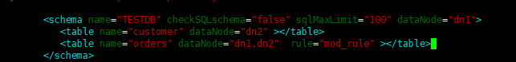

#### 4、 修改配置文件rule.xml

在rule配置文件里新增分片规则`mod_rule`，并指定规则适用字段为customer_id， 还有选择分片算法mod-long（对字段求模运算），customer_id对两个节点求模，根据结果分片。

配置算法`mod-long`参数count为2，两个节点

```xml
<tableRule name="mod_rule">
	<rule>
		<columns>customer_id</columns>
		<algorithm>mod-long</algorithm>
	</rule>
</tableRule>
…
<function name="mod-long" class="io.mycat.route.function.PartitionByMod">
	<!-- how many data nodes -->
	<property name="count">2</property>
</function>

```

如下图：

 

 

#### 5、在数据节点dn2上建orders表

由于dn1在前面题目中已经创建了orders表，而dn2机器上没有。这里需要执行如下的命令，在dn2上创建orders表：

```mysql
#订单表   rows:600万
CREATE TABLE orders(
    id INT AUTO_INCREMENT,
    order_type INT,
    customer_id INT,
    amount DECIMAL(10,2),
    PRIMARY KEY(id)  
); 
```

#### 6、重启Mycat让配置生效

```
./mycat console
```

#### 7、访问Mycat实现分片

```
#在mycat里向orders表插入数据，INSERT字段不能省略

INSERT INTO orders(id,order_type,customer_id,amount) VALUES(1,101,100,100100);
INSERT INTO orders(id,order_type,customer_id,amount) VALUES(2,101,100,100300);
INSERT INTO orders(id,order_type,customer_id,amount) VALUES(3,101,101,120000);
INSERT INTO orders(id,order_type,customer_id,amount) VALUES(4,101,101,103000);
INSERT INTO orders(id,order_type,customer_id,amount) VALUES(5,102,101,100400);
INSERT INTO orders(id,order_type,customer_id,amount) VALUES(6,102,100,100020);
```

> 注意，这里不能使用 INSERT INTO orders VALUES (1,101,100,100100); 语句实现向orders表中插入数据。因为但凡使用mycat实现分表，必须显式指明分表的字段。

在mycat、dn1、dn2中查看orders表数据，分表成功。


### 7.2 Mycat 的分片 “join”

Orders订单表已经进行分表操作了，和它关联的orders_detail订单详情表如何进行join查询。

我们也要对orders_detail进行分片操作。Join的原理如下图：


#### 1、ER表

Mycat 借鉴了 NewSQL 领域的新秀 Foundation DB 的设计思路，Foundation DB 创新性的提出了 Table Group 的概念，其**将子表的存储位置依赖于主表，并且物理上紧邻存放，因此彻底解决了 JOIN 的效率和性能问题**，根据这一思路，提出了`基于 E-R 关系的数据分片`策略，子表的记录与所关联的父表记录存放在同一个数据分片上。

**① 修改schema.xml配置文件**

```xml
…
<table name="orders" dataNode="dn1,dn2"  rule="mod_rule" >
    <childTable name="orders_detail" primaryKey="id" joinKey="order_id" parentKey="id" />
</table>
…

```


**② 在dn2创建orders_detail表**

重启Mycat前注意，dn2 上不存在orders_detail表，需要创建此表。语句见上面。

**③ 重启Mycat**

**④ 访问Mycat向orders_detail表插入数据：**

```
INSERT INTO orders_detail(id,detail,order_id) values(1,'detail1',1);
INSERT INTO orders_detail(id,detail,order_id) VALUES(2,'detail1',2);
INSERT INTO orders_detail(id,detail,order_id) VALUES(3,'detail1',3);
INSERT INTO orders_detail(id,detail,order_id) VALUES(4,'detail1',4);
INSERT INTO orders_detail(id,detail,order_id) VALUES(5,'detail1',5);
INSERT INTO orders_detail(id,detail,order_id) VALUES(6,'detail1',6);
```

**⑤ 在mycat、dn1、dn2中运行两个表join语句**

```
Select o.*,od.detail 
from orders o inner join orders_detail od 
on o.id=od.order_id;
```


#### 2、全局表

在分片的情况下，当业务表因为规模而进行分片以后，`业务表`与这些附属的`字典表`之间的关联，就成了比较棘手的问题，考虑到字典表具有以下几个`特性`：

​		①  变动不频繁

​		②  数据量总体变化不大

​		③  数据规模不大，很少有超过数十万条记录

鉴于此，Mycat 定义了一种特殊的表，称之为“`全局表`”，全局表具有以下特性：

​		①  全局表的插入、更新操作会实时在所有节点上执行，保持各个分片的数据一致性

​		②  全局表的查询操作，只从一个节点获取

​		③  全局表可以跟任何一个表进行 JOIN 操作

将字典表或者符合字典表特性的一些表定义为全局表，则从另外一个方面，很好的解决了数据 JOIN 的难题。通过`全局表 + 基于E-R关系`的分片策略，Mycat 可以满足 80%以上的企业应用开发。

**① 修改schema.xml配置文件**

```xml
…
<table name="orders" dataNode="dn1,dn2"  rule="mod_rule" >
    <childTable name="orders_detail" primaryKey="id" joinKey="order_id" parentKey="id" />
</table>
<table name="dict_order_type" dataNode="dn1,dn2" type="global" ></table>
…

```


**② 在dn2创建dict_order_type表**

重启Mycat前注意，dn2 上不存在dict_order_type表，需要创建此表。语句见上面。

**③ 重启Mycat**

**④ 访问Mycat向dict_order_type表插入数据**

```
INSERT INTO dict_order_type(id,order_type) VALUES(101,'type1');
INSERT INTO dict_order_type(id,order_type) VALUES(102,'type2');
```

**⑤ 在Mycat、dn1、dn2中查询表数据**

在不同机器上查询dict_order_type表中的数据都是完整的。


### 7.3 常用分片规则

#### 方式1：取模

此规则是对分片字段求模运算。也是水平分表最常用规则。6.1配置分表中，orders表采用了此规则。

#### 方式2：分片枚举

通过在配置文件中配置可能的枚举id，自己配置分片。本规则适用于特定的场景，比如有些业务需要按照`省份`或`区县`来做保存，而全国省份区县固定的，这类业务使用本条规则。

**（1）修改schema.xml配置文件**

```xml
<!-- 订单归属区域信息表  -->
<table name="orders_ware_info" dataNode="dn1,dn2" rule="sharding_by_intfile" ></table>
```

**（2）修改rule.xml配置文件**

```xml
<tableRule name="sharding_by_intfile">
	<rule>
		<columns>areacode</columns>
		<algorithm>hash-int</algorithm>
	</rule>
</tableRule>

…

<function name="hash-int" class="io.mycat.route.function.PartitionByFileMap">
	<property name="mapFile">partition-hash-int.txt</property>
	<property name="type">1</property>
	<property name="defaultNode">0</property>
</function>

# columns：分片字段，algorithm：分片函数
# mapFile：标识配置文件名称
# type：0为int型、非0为String
#defaultNode：默认节点:小于 0 表示不设置默认节点，大于等于 0 表示设置默认节点，
#             设置默认节点如果碰到不识别的枚举值，就让它路由到默认节点，如不设置不识别就报错
```

**（3）修改partition-hash-int.txt配置文件**

```properties
110=0    # 0 表示第1个数据节点
120=1    # 1 表示第2个数据节点
```

**（4）重启Mycat**

**（5）访问Mycat创建表**

```mysql
#订单归属区域信息表  
CREATE TABLE  orders_ware_info(
    `id`        INT AUTO_INCREMENT comment '编号',
    `order_id`  INT comment '订单编号',
    `address`   VARCHAR(200) comment '地址',
    `areacode`  VARCHAR(20) comment '区域编号',
    PRIMARY KEY(id)
); 
```

**（6）插入数据**

```mysql
INSERT INTO orders_ware_info(id, order_id,address,areacode) VALUES (1,1,'北京','110');
INSERT INTO orders_ware_info(id, order_id,address,areacode) VALUES (2,2,'天津','120');
```

**（7）查询Mycat、dn1、dn2可以看到数据分片效果**

 

#### 方式3：范围约定

此分片适用于，提前规划好分片字段某个范围属于哪个分片。

**（1）修改schema.xml配置文件**

```xml
<!-- 针对支付信息表 -->
<table name="payment_info" dataNode="dn1,dn2" rule="auto_sharding_long" ></table>
```

**（2）修改rule.xml配置文件**

```xml
<tableRule name="auto_sharding_long">
	<rule>
		<columns>order_id</columns>
		<algorithm>rang-long</algorithm>
	</rule>
</tableRule>
…
<function name="rang-long" class="io.mycat.route.function.AutoPartitionByLong">
	<property name="mapFile">autopartition-long.txt</property>
	<property name="defaultNode">0</property>
</function> 

# columns：分片字段，algorithm：分片函数
# mapFile：标识配置文件名称
# defaultNode：默认节点:小于 0 表示不设置默认节点，大于等于 0 表示设置默认节点，
#              设置默认节点如果碰到不识别的枚举值，就让它路由到默认节点，如不设置不识别就报错
```

**（3）修改autopartition-long.txt配置文件**

```
0-102=0
103-200=1 
```

**（4）重启Mycat**
**（5）访问Mycat，并创建表**

```mysql
#支付信息表  
CREATE TABLE  payment_info(
    `id`               INT AUTO_INCREMENT comment '编号',
    `order_id`         INT comment '订单编号',
    `payment_status`   INT comment '支付状态',
    PRIMARY KEY(id)
);
```

**（6）插入数据**

```mysql
INSERT INTO payment_info (id,order_id,payment_status) VALUES (1,101,0);
INSERT INTO payment_info (id,order_id,payment_status) VALUES (2,102,1);
INSERT INTO payment_info (id,order_id ,payment_status) VALUES (3,103,0);
INSERT INTO payment_info (id,order_id,payment_status) VALUES (4,104,1);
```

**（7）查询Mycat、dn1、dn2可以看到数据分片效果**

 

#### 方式4：按日期（天）分片

此规则为按天分片。设定时间格式、范围：

**（1）修改schema.xml配置文件**

```xml
<!-- 针对用户信息表 -->
<table name="login_info" dataNode="dn1,dn2" rule="sharding_by_date" ></table>
```

**（2）修改rule.xml配置文件**

```xml
<tableRule name="sharding_by_date">
	<rule>
		<columns>login_date</columns>
		<algorithm>shardingByDate</algorithm>
	</rule>
</tableRule>
…
<function name="shardingByDate" class="io.mycat.route.function.PartitionByDate">
	<property name="dateFormat">yyyy-MM-dd</property>
	<property name="sBeginDate">2019-01-01</property>
	<property name="sEndDate">2019-01-04</property>
	 <property name="sPartionDay">2</property> 
</function> 

# columns：分片字段，algorithm：分片函数
# dateFormat ：日期格式
# sBeginDate ：开始日期 
# sEndDate：结束日期,则代表数据达到了这个日期的分片后循环从开始分片插入。如果不设定，会报错
# sPartionDay ：分区天数，即默认从开始日期算起，分隔 2 天一个分区
```

**（3）重启Mycat**
**（4）访问Mycat创建表**

```mysql
#用户信息表  
CREATE TABLE  login_info(
    `id`            INT AUTO_INCREMENT comment '编号',
    `user_id`       INT comment '用户编号',
    `login_date`    date comment '登录日期',
    PRIMARY KEY(id)
); 
```

**（6）插入数据**

```mysql
INSERT INTO login_info(id,user_id,login_date) VALUES (1,101,'2019-01-01');
INSERT INTO login_info(id,user_id,login_date) VALUES (2,102,'2019-01-02');
INSERT INTO login_info(id,user_id,login_date) VALUES (3,103,'2019-01-03');
INSERT INTO login_info(id,user_id,login_date) VALUES  (4,104,'2019-01-04');
INSERT INTO login_info(id,user_id,login_date) VALUES (5,103,'2019-01-05');
INSERT INTO login_info(id,user_id,login_date) VALUES (6,104,'2019-01-06'); 
```

**（7）查询Mycat、dn1、dn2可以看到数据分片效果**

 

### 7.4 全局ID序列

**在实现分库分表的情况下，数据库自增主键已无法保证自增主键的全局唯一。**为此，Mycat 提供了`全局 sequence`，并且提供了包含`本地配置`和`数据库配置`等多种实现方式。

#### 方式1：本地文件（不推荐）

此方式 Mycat 将 sequence 配置到文件中，当使用到 sequence 中的配置后，Mycat 会更下 classpath 中的 `sequence_conf.properties` 文件中 `sequence 当前的值`。

​		①   优点：本地加载，读取速度较快

​		②   缺点：抗风险能力差，Mycat所在主机宕机后，无法读取本地文件。


#### 方式2：数据库方式（推荐）

利用数据库一个表来进行计数累加，可行。但是每次生成序列都读写数据库，这样效率太低。

**优化：**Mycat会预加载一部分号段到Mycat的内存中，这样大部分读写序列都是在内存中完成的。

如果内存中的号段用完了，Mycat会再向数据库要一次。

 

> **问：那如果Mycat崩溃了 ，那内存中的序列岂不是都没了？**
>
> **答：**是的。如果是这样，那么Mycat启动后会向数据库申请新的号段，原有号段会弃用。
>
> 也就是说如果Mycat重启，那么损失是当前的号段没用完的号码，但是不会因此出现主键重复。
>

 

**① 建库序列脚本**

在dn1上执行如下操作：(以下脚本来自官方)

```mysql
#在dn1上创建全局序列表
CREATE TABLE MYCAT_SEQUENCE (NAME VARCHAR(50) NOT NULL,current_value INT NOT
NULL,increment INT NOT NULL DEFAULT 100, PRIMARY KEY(NAME)) ENGINE=INNODB;

#创建全局序列所需函数
DELIMITER $$ 
CREATE FUNCTION mycat_seq_currval(seq_name VARCHAR(50)) RETURNS VARCHAR(64)
DETERMINISTIC  
BEGIN
DECLARE retval VARCHAR(64);
SET retval="-999999999,null";
SELECT CONCAT(CAST(current_value AS CHAR),",",CAST(increment AS CHAR)) INTO retval FROM
MYCAT_SEQUENCE WHERE NAME = seq_name;
RETURN retval;
END $$
DELIMITER ;
 
DELIMITER $$
CREATE FUNCTION mycat_seq_setval(seq_name VARCHAR(50),VALUE INTEGER) RETURNS VARCHAR(64)
DETERMINISTIC
BEGIN
UPDATE MYCAT_SEQUENCE
SET current_value = VALUE
WHERE NAME = seq_name;
RETURN mycat_seq_currval(seq_name);
END $$
DELIMITER ;
 
DELIMITER $$
CREATE FUNCTION mycat_seq_nextval(seq_name VARCHAR(50)) RETURNS VARCHAR(64) 
DETERMINISTIC
BEGIN
UPDATE MYCAT_SEQUENCE
SET current_value = current_value + increment WHERE NAME = seq_name;
RETURN mycat_seq_currval(seq_name);
END $$
DELIMITER ;

#初始化序列表记录
INSERT INTO MYCAT_SEQUENCE(NAME,current_value,increment) 
VALUES ('ORDERS', 400000,100);

```

 

**② 修改Mycat配置**

**修改sequence_db_conf.properties ：**

```
vim sequence_db_conf.properties
```

意思是 ORDERS 这个序列在 dn1 这个节点上，具体dn1节点是哪台机子，请参考schema.xml

 

**修改server.xml  ：**

```
vim server.xml
```

全局序列类型：0-本地文件，1-数据库方式，2-时间戳方式。此处应该修改成1。

 

**重启Mycat**

**③ 验证全局序列**

登录Mycat，插入数据：（可执行多次如下数据）

```mysql
insert into orders(id,amount,customer_id,order_type) values(next value for MYCATSEQ_ORDERS,1000,101,102);
```

 查询数据


模拟Mycat宕机（重启Mycat）后，再次Mycat中插入数据，再查询


#### 方式3：时间戳方式（不推荐）

全局序列ID= `64 位二进制 (42(毫秒)`+`5(机器 ID)`+`5(业务编码)`+`12(重复累加)` 换算成十进制为 18 位数的 long 类型，每毫秒可以并发 12 位二进制的累加。 

​		①   优点：配置简单

​		②   缺点：18位ID过长

####  方式4：自主生成全局序列

可在`Java项目`里自己生成全局序列，如下：

​		①  根据业务逻辑组合

​		②  可以利用 redis 的单线程原子性 incr来生成序列

​		③  Twitter的雪花算法

但，自主生成需要单独在工程中用Java代码实现，还是推荐使用Mycat自带全局序列。


